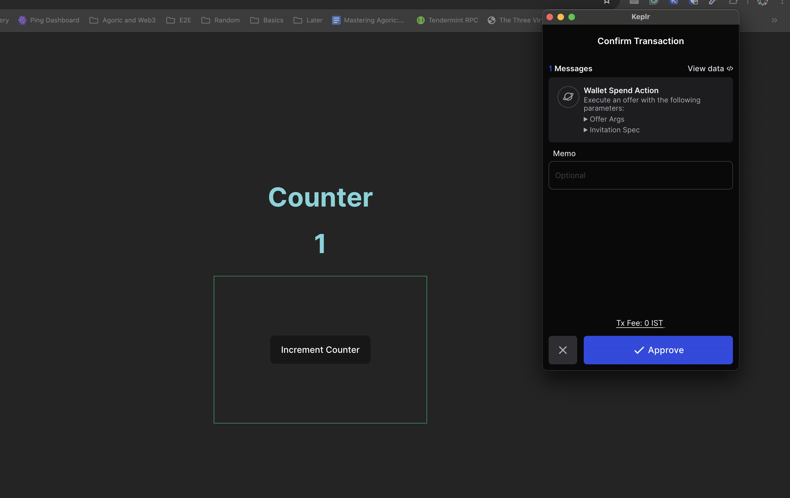

The Counter Contract is an Agoric smart contract designed to maintain a counter that increments each time an invitation to increment is accepted.

# To Deploy Contract

- Start the agoric chain locally: `docker run -d -p 26657:26657 -p 1317:1317 -p 9090:9090 ghcr.io/agoric/agoric-3-proposals:latest`

- Ensure that `agoric` is installed globally on your computer. If it's not installed, you can install it using the following command:

  ```bash
  npm install -g @agoric
  ```

- Verify that `jq` is also installed. If you need to install it, you can use the following command depending on your operating system:

  ```bash
  brew install jq # Mac OS
  sudo apt-get install jq # Linux
  ```

- After confirming that all prerequisites are met, run the deployment script with:

  ```bash
  yarn deploy
  ```

- To start the UI and interact with the contract, execute:

  ```bash
  yarn start:ui
  ```
